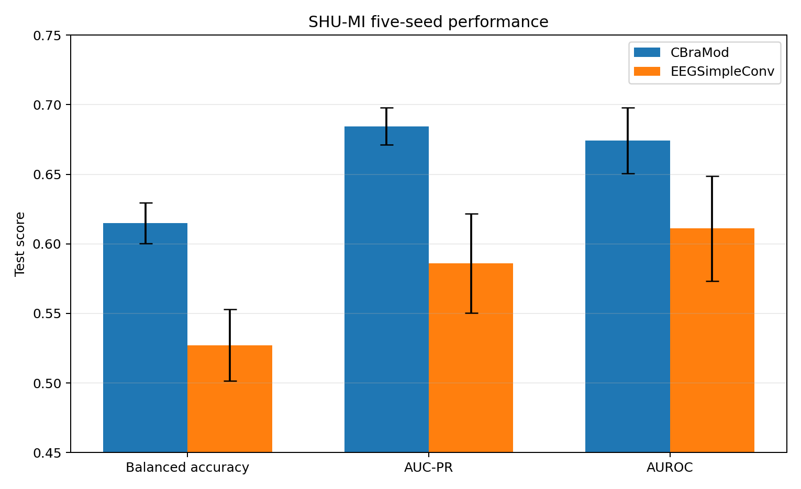
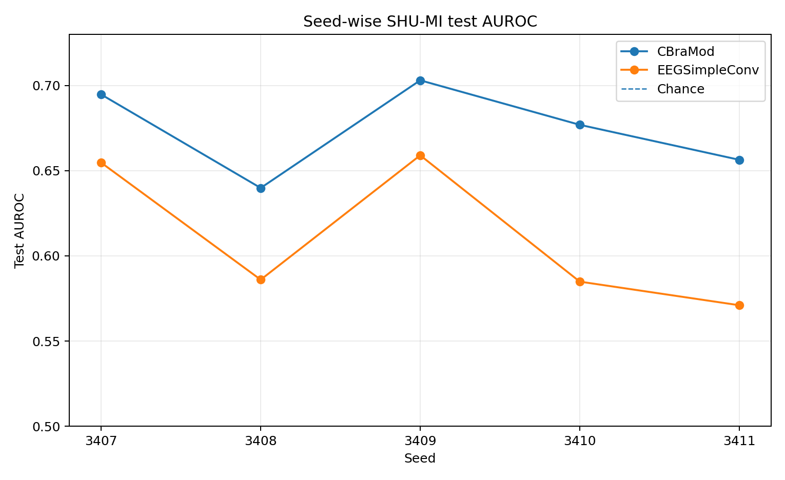
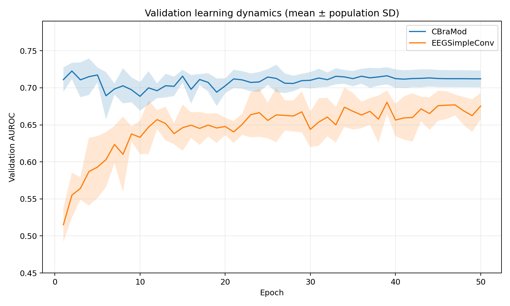

# CBraMod Homework — Technical Report

## Executive summary

This repository addresses the three implementation tasks in the take-home and
prepares a design proposal for large-scale EEG pretraining:

1. **Task A — Code review:** review the original CBraMod preprocessing and data
   loading pipeline, identify reproducibility and scalability risks, and
   implement a cleaner alternative.
2. **Task B — SHU-MI reproduction:** preprocess the full SHU-MI dataset,
   fine-tune the released CBraMod checkpoint using the paper's subject split,
   and aggregate results across five seeds.
3. **Task C — Alternative architecture:** adapt EEGSimpleConv to the same data
   representation and evaluation protocol, then compare predictive performance
   and operational efficiency against CBraMod.
4. **Part 2 — Data harmonization design:** propose a reproducible architecture
   for processing and streaming heterogeneous EEG data at multi-terabyte scale.

The CBraMod reproduction is complete. Across five seeds, it obtained:

| Metric | Reproduction | Paper | Difference |
|---|---:|---:|---:|
| Balanced accuracy | **0.6149 ± 0.0148** | 0.6370 ± 0.0151 | -0.0221 |
| AUC-PR | **0.6845 ± 0.0133** | 0.7139 ± 0.0088 | -0.0294 |
| AUROC | **0.6742 ± 0.0235** | 0.6988 ± 0.0068 | -0.0246 |

The reproduction is in the same performance range as the paper, although its
mean scores are approximately 2–3 absolute percentage points lower and its
seed-to-seed variance is larger. One run reached an AUROC of 0.7031, slightly
above the reported paper mean, which supports the correctness of the main data,
checkpoint, training, and evaluation paths.

The EEGSimpleConv comparison is also complete. Across the same five seeds it
obtained balanced accuracy **0.5271 ± 0.0257**, AUC-PR **0.5861 ± 0.0356**, and
AUROC **0.6111 ± 0.0377**. CBraMod won every metric for every seed, with mean
advantages of 0.0878 balanced-accuracy points, 0.0984 AUC-PR points, and 0.0631
AUROC points. EEGSimpleConv is approximately 34.5× smaller, but showed greater
seed sensitivity and severe fixed-threshold calibration instability.

---

# Engineering and reproducibility work

Before running the experiments, the provided scaffold was converted into a
small, testable Python package. Python 3.13 and the current PyTorch/CUDA stack
were intentionally retained.

## Package structure and circular-import fix

The initial package layout used eager imports from package-level `__init__.py`
files, while internal modules imported objects back through those aggregating
modules. This made imports dependent on execution order and produced a circular
import failure.

The import graph was simplified as follows:

- the root `cbramod_experiments/__init__.py` remains lightweight;
- internal modules import symbols from their defining modules rather than from
  package aggregators;
- `factory.py` uses direct relative model imports;
- `datasets.__init__` exposes only the intended public dataset API;
- `utils.__init__` uses a valid `__all__` declaration;
- an import-order regression test verifies that all public packages can be
  imported independently.

This keeps package initialization free of side effects and makes the dependency
direction explicit.

## Test and quality infrastructure

The repository includes tests for:

- subject and session parsing;
- subject-level split assignment;
- SHU-MI preprocessing and dataset auditing;
- binary metric definitions;
- CBraMod and EEGSimpleConv forward shapes;
- exact EEGSimpleConv feature-map growth;
- checkpoint key remapping and checksum validation;
- optimizer and scheduler configuration;
- training-loop integration;
- multi-seed reproduction aggregation;
- architecture benchmarking;
- comparison-report generation;
- package import order.

Small model fixtures are used for fast unit tests, while full-shape behavior is
covered separately. PyTorch's test thread pools are constrained so tiny CPU tests
do not become unexpectedly slow on high-core machines.

The completed development workflow is exposed through the Makefile:

```bash
make sync
make test
make test-verbose
make smoke
make format
make format-check
make lint
make lint-fix
make typecheck
make check
```

The packaging configuration was also corrected so built wheels contain the
`datasets`, `models`, and `utils` subpackages rather than only the root package.

---

# Task A — Code review and reproducibility

## 1. Review approach

The review focused on the original CBraMod code paths used for SHU-MI:

- MATLAB preprocessing;
- LMDB serialization;
- dataset and DataLoader construction;
- training configuration and orchestration;
- checkpoint loading;
- metric computation;
- experiment reproducibility and scalability.

The goal was not only to list style concerns, but to identify issues that could
change experimental validity, complicate reproduction, or prevent the pipeline
from scaling to larger EEG corpora.

## 2. Data loading pipeline

### Strengths

The original pipeline has several practical strengths:

- **Offline preprocessing:** resampling is performed once before training rather
  than repeatedly in each epoch.
- **Random-access storage:** LMDB provides efficient key-value access and avoids
  loading the complete dataset into memory.
- **Simple sample contract:** each stored item contains an EEG example and its
  label, which makes the downstream loader straightforward.
- **Task-specific representation:** SHU-MI trials are converted directly to the
  four-second, 200 Hz format expected by CBraMod.
- **Clear subject protocol in the experiment:** the intended train, validation,
  and test groups correspond to subjects 1–15, 16–20, and 21–25.

### Weaknesses and risks

#### The split depends on filename ordering

The released preprocessing sorts files and assigns fixed positional ranges to
train, validation, and test. This assumes that filename order always corresponds
to subject order and that every subject contributes exactly the expected number
of files.

This can silently produce leakage or incorrect assignments if:

- extraction changes filenames;
- sorting is lexicographic rather than numeric;
- a session is missing;
- an extra file is present;
- the archive layout changes.

A scientific split should be expressed in terms of parsed subject IDs and then
validated explicitly.

#### Validation and test loaders are shuffled

Shuffling does not normally change aggregate metrics, but it is unnecessary for
validation and testing and makes sample order less predictable during debugging.
Deterministic evaluation loaders are clearer and easier to audit.

#### Amplitude scaling is implicit

The loader divides every signal by `100`. The scaling factor is not attached to
the stored data as metadata and is therefore easy to miss when another loader or
format is introduced.

A consumer that forgets this operation will run on a different input
distribution despite using the same processed files.

#### Pickle payloads do not define a durable schema

Pickled Python objects inside LMDB are convenient but have drawbacks:

- they are Python-specific;
- their structure is not self-describing;
- schema evolution is difficult to validate;
- they should not be loaded from untrusted data;
- inspecting metadata without deserializing samples is inconvenient.

#### Multiprocessing behavior is fragile

Opening storage resources during dataset construction can interact poorly with
DataLoader worker creation, especially across different operating systems and
process start methods. Worker-local lazy handles are safer.

#### Loader performance is not configurable enough

The original path does not consistently expose or document:

- `num_workers`;
- `pin_memory`;
- `persistent_workers`;
- worker seeding;
- prefetching;
- distributed sampler behavior.

These options become important when model throughput increases or data moves to
remote storage.

## 3. Preprocessing code

### Strengths

- It applies the expected conversion from 250 Hz to 200 Hz.
- It preserves four-second windows, producing 800 samples per trial.
- It maps the motor-imagery labels to a binary problem.
- It separates preprocessing from model training.
- It produces a representation directly compatible with the downstream model.

### Weaknesses and risks

#### Hard-coded paths and script-level execution

Machine-specific paths and executable global code reduce portability. The
preprocessor should be a reusable function with a CLI, explicit arguments, and
clear failure messages.

#### Insufficient input validation

The original script assumes the expected MATLAB keys and dimensions. A robust
pipeline should verify:

- the existence of `data` and `labels`;
- `[trial, channel, time]` layout;
- matching trial and label counts;
- consistent channel count;
- the original sampling length;
- binary label values;
- valid subject IDs;
- complete split coverage.

#### One transaction per stored example

Committing storage transactions at very fine granularity increases write
overhead. Larger batched writes or array-oriented chunked formats are more
appropriate for offline preprocessing.

#### Missing provenance

The processed samples do not carry enough information to reconstruct their
origin. Useful fields include:

- subject and session IDs;
- source filename;
- trial index;
- original and target sampling rates;
- channel names;
- amplitude scale;
- preprocessing version;
- split protocol.

#### No integrity report

A successful script exit does not guarantee that the resulting dataset matches
the paper. The output should be audited before any expensive training run.

## 4. Overall code quality

The authors' repository is valuable research code: it exposes the architecture,
pretraining checkpoint, downstream datasets, and training logic in a relatively
direct way. This makes the method understandable and modifiable.

However, it has characteristics typical of code written primarily to support
experiments rather than a maintained production pipeline:

- configuration, model creation, and orchestration are tightly coupled;
- large conditional blocks select datasets and task behavior;
- defaults contain environment-specific paths;
- dependency versions are not fully pinned;
- `type=bool` command-line arguments can parse values unexpectedly;
- CUDA setup is assumed in places where CPU execution should remain possible;
- public interfaces and serialization schemas are not versioned;
- reproducibility checks are mostly implicit;
- automated tests are limited.

These issues do not invalidate the research, but they increase the effort needed
to reproduce results reliably or scale the implementation.

## 5. Scalability concerns

### Storage and file layout

A large collection of small serialized examples increases metadata operations
and random I/O pressure. At terabyte scale, sequentially readable shards and
array-oriented storage become more efficient.

### Repeated preprocessing

Without dataset-level manifests, content hashes, and stage caching, it is hard to
determine whether two runs use exactly the same preprocessing output. Re-running
several terabytes unnecessarily is expensive.

### Distributed training

A scalable loader needs:

- deterministic sharding across ranks and workers;
- subject-aware sampling;
- no duplicate samples within an epoch;
- resumable iteration;
- node-local caching;
- asynchronous prefetch;
- observability for I/O stalls and corrupt records.

### Memory and throughput

Pickled per-sample payloads introduce deserialization overhead and make vectorized
reads difficult. Storage throughput can become the bottleneck once multiple GPUs
consume data concurrently.

### Data quality

At large scale, a pipeline must track missing channels, unusual sampling rates,
flat signals, saturation, excessive artifacts, invalid event markers, and
subject-level metadata quality. Silent failures can otherwise dominate model
training.

## 6. Implemented corrections

The replacement pipeline in this repository provides:

- explicit parsing of subject and session IDs;
- subject-based split assignment rather than positional file slicing;
- validation of every MATLAB file and label set;
- deterministic conversion from `[trials, 32, 1000]` to `[trials, 32, 800]`;
- a versioned, chunked HDF5 schema;
- source filename, subject, session, and trial provenance;
- split indices stored alongside the signals;
- preprocessing metadata stored as HDF5 attributes;
- a JSON preprocessing summary;
- lazy worker-safe reading;
- deterministic worker and sampler seeding;
- configurable DataLoader performance options;
- deterministic validation and test iteration;
- a strict dataset audit before full experiments.

The HDF5 file retains raw resampled amplitudes. The paper's division by `100` is
applied consistently at load time and recorded in the file metadata.

---

# Task B — Reproduce CBraMod on SHU-MI

## 1. Dataset and protocol

The reproduction follows the stated SHU-MI protocol:

- 25 subjects;
- five sessions per subject in the source archive;
- 32 EEG channels;
- four-second motor-imagery trials;
- original sampling rate of 250 Hz;
- target sampling rate of 200 Hz;
- 800 time points after resampling;
- subjects 1–15 for training;
- subjects 16–20 for validation;
- subjects 21–25 for testing;
- 11,988 examples in total.

The preprocessor recursively discovers MATLAB files, validates their structure,
resamples with `scipy.signal.resample`, maps labels from `1/2` to `0/1` when
necessary, and stores the result in one HDF5 dataset.

## 2. Dataset integrity audit

Before a reported run, strict inspection requires:

- exactly 11,988 examples;
- 32 channels and 800 samples per example;
- all 25 expected subjects;
- subjects 1–15 only in train;
- subjects 16–20 only in validation;
- subjects 21–25 only in test;
- both classes in every split;
- complete assignment of every example;
- no overlap between split indices;
- no subject leakage.

The repository also contains one real subject-1 sample for smoke testing. It is
accepted for pipeline validation but deliberately rejected by strict mode as a
reportable reproduction dataset.

## 3. Pretrained checkpoint validation

The released Hugging Face checkpoint is validated before training:

- expected filename: `pretrained_weights.pth`;
- expected SHA256:
  `0792cb808c14e6b7a2bb2ce1dff379bc47bc54c49a779825bdfeb33bf8157178`;
- source keys are remapped to the cleaned package structure;
- loading requires architectural compatibility rather than silently accepting
  missing backbone parameters.

The checkpoint can be downloaded automatically or supplied as a local path.
Each run records the checkpoint hash in its provenance metadata.

## 4. Model and training configuration

The reproduction uses the released CBraMod backbone and the
`all_patch_reps` downstream classifier.

Input samples are loaded as `[B, 32, 800]`, divided by `100`, and reshaped for
CBraMod as `[B, 32, 4, 200]`.

The paper-aligned training configuration is:

| Setting | Value |
|---|---:|
| Epochs | 50 |
| Batch size | 64 |
| Optimizer | AdamW |
| Backbone learning rate | `1e-4` |
| Classifier learning rate | `5e-4` |
| Weight decay | `0.05` |
| Scheduler | cosine annealing after every optimizer step |
| Minimum learning rate | `1e-6` |
| Gradient clipping | global norm `1.0` |
| Precision | full precision |
| Selection metric | validation AUROC |
| Test access | once, after checkpoint selection |

The classifier learning rate matches the released expression:

```text
0.001 × sqrt(batch_size / 256)
= 0.001 × sqrt(64 / 256)
= 0.0005
```

The public training code evaluates test performance whenever validation AUROC
improves. This implementation instead stores the best validation checkpoint and
evaluates the test set once at the end. This avoids repeated test-set access
without changing which checkpoint is selected.

## 5. Metrics

The common evaluator reports:

- balanced accuracy using a probability threshold of `0.5`;
- AUROC;
- AUC-PR using trapezoidal integration of the precision-recall curve;
- average precision as a separate diagnostic metric;
- confusion matrix;
- number of evaluated examples.

AUC-PR and average precision are intentionally kept separate because they are
not numerically identical on finite datasets. The headline AUC-PR follows the
released CBraMod evaluator.

## 6. Five-seed results

The runs used seeds `3407, 3408, 3409, 3410, 3411` and were executed separately
to avoid sustained thermal load on a single GPU. Sequential execution does not
change the statistical interpretation because the runs are independent.

### Per-seed test metrics

| Seed | Best epoch | Balanced accuracy | AUC-PR | AUROC |
|---:|---:|---:|---:|---:|
| 3407 | 5 | 0.6233 | 0.6983 | 0.6948 |
| 3408 | 26 | 0.5914 | 0.6635 | 0.6399 |
| 3409 | 1 | **0.6354** | **0.6986** | **0.7031** |
| 3410 | 3 | 0.6164 | 0.6851 | 0.6770 |
| 3411 | 8 | 0.6081 | 0.6772 | 0.6564 |

### Aggregate comparison

| Metric | Reproduction | Paper | Difference |
|---|---:|---:|---:|
| Balanced accuracy | **0.6149 ± 0.0148** | 0.6370 ± 0.0151 | -0.0221 |
| AUC-PR | **0.6845 ± 0.0133** | 0.7139 ± 0.0088 | -0.0294 |
| AUROC | **0.6742 ± 0.0235** | 0.6988 ± 0.0068 | -0.0246 |

The table uses population standard deviation across the five runs, matching the
summary produced by the repository. Per-seed records and all run metadata are
retained in the output directories.

## 7. Interpretation

### The main pipeline appears correct

The results are consistently above chance and in the same broad range as the
paper. Seed 3409 reaches an AUROC of 0.7031, slightly exceeding the paper's mean
AUROC of 0.6988. This makes a major error in label mapping, split construction,
checkpoint loading, or metric direction unlikely.

### The reproduction is approximate, not exact

The five-run means are 2–3 absolute percentage points lower than the paper.
Therefore the appropriate wording is that the reported performance range was
approximately reproduced, rather than that every aggregate value was matched.

### There is substantial seed sensitivity

Test AUROC ranges from 0.6399 to 0.7031. Seed 3408 is a clear low outlier and
contributes strongly to the larger observed standard deviation.

The exact random seeds used in the paper are not published. Moreover, the same
integer seed does not imply the same trajectory across implementations because
random-number consumption depends on model construction, DataLoader behavior,
worker setup, dropout, CUDA kernels, and framework version.

### There is a validation-to-test generalization gap

The mean validation AUROC is approximately 0.738, while the mean test AUROC is
approximately 0.674. Model selection uses subjects 16–20, whereas final testing
uses subjects 21–25. The gap suggests that the selected checkpoint can fit
characteristics of one held-out subject group that do not transfer equally to
the other.

### The model overfits quickly

Four of five selected checkpoints occur in the first eight epochs, with a median
best epoch of five. Training loss continues to decrease afterwards while
validation performance typically declines. The full 50-epoch schedule is kept
for reproduction fidelity, but early stopping would be preferable for routine
development and would reduce GPU time.

## 8. Why the numbers may differ from the paper

The most plausible explanations, in order, are:

1. **Different random trajectories.** The paper does not identify its exact
   seeds, and CBraMod fine-tuning is visibly seed-sensitive on this split.
2. **Held-out-subject variability.** Five validation and five test subjects make
   model selection sensitive to individual subject characteristics.
3. **Framework and hardware differences.** The reproduction uses Python 3.13
   and a current PyTorch/CUDA stack. Attention, matrix multiplication, FFT,
   dropout, and random-number behavior can differ from the authors' environment.
4. **Different RNG consumption and sample order.** This implementation uses
   explicit worker and DataLoader generators; the released loader relies more on
   global RNG state.
5. **No frozen paper-code release.** The public repository is not tagged as the
   exact experiment snapshot used to create the table.
6. **Minor numerical preprocessing differences.** Unpinned SciPy and NumPy
   versions can introduce small differences in Fourier resampling.

The following are unlikely explanations:

- GPU heating, unless it caused errors or NaNs; thermal throttling normally affects runtime rather than model quality;
- The dataset split, because it is audited explicitly;
- The checkpoint file, because its hash is verified;
- The metric implementation, which matches the released evaluator's AUC-PR definition.

A useful additional diagnostic would be to load the same checkpoint into the
authors' model and this implementation, run both in evaluation mode on a fixed
input, and measure the maximum absolute logit difference. This would distinguish
backbone-equivalence questions from ordinary fine-tuning variance.

## 9. Reproduction commands

```bash
make preprocess \
  RAW_DIR=/absolute/path/to/shu/mat_files \
  DATASET=data/processed/shu_mi.h5 \
  OVERWRITE=1

make inspect-data DATASET=data/processed/shu_mi.h5
make check-checkpoint

make reproduce-cbramod \
  DATASET=data/processed/shu_mi.h5 \
  OUTPUT_DIR=outputs/cbramod_shu_mi
```

Each seed directory contains:

```text
resolved_config.json
run.json
history.json
best_model.pt
metrics.json
```

The aggregate report is written to:

```text
outputs/cbramod_shu_mi/summary.json
```

A more concise experiment report is also available in
`reports/shu_mi_reproduction.md`.

---

# Task C — EEGSimpleConv comparison

## 1. Objective and interpretation boundary

This experiment compares the two practical choices requested by the homework:

1. fine-tune the released pretrained CBraMod model;
2. train EEGSimpleConv from scratch on exactly the same SHU-MI examples.

The comparison controls the dataset and evaluation protocol, but it is not a
pure causal architecture ablation. CBraMod benefits from large-scale
pretraining and uses its own fine-tuning recipe, while EEGSimpleConv is randomly
initialized and uses its documented optimizer schedule. The experiment
therefore answers the practical model-selection question, not only
"attention versus convolution."

## 2. Architectures

### CBraMod

CBraMod receives each four-second trial as `[B, 32, 800]` and reshapes it into
four 200-sample patches per channel:

```text
[B, 32, 800] -> [B, 32, 4, 200]
```

Its patch embedding combines two complementary representations:

- a temporal convolutional projection of each waveform patch;
- an explicit magnitude spectrum computed with an `rFFT`.

The resulting 200-dimensional patch representations pass through 12 criss-cross
encoder layers. Each layer separates the representation into two halves:

- **spatial attention** attends across the 32 electrodes independently for each
  temporal patch;
- **temporal attention** attends across the four temporal patches independently
  for each electrode.

This factorization models both channel interactions and temporal context without
performing full attention over all 128 channel-patch tokens at once. A
feed-forward network and residual pre-normalization complete each layer.

For this experiment, all 128 patch representations are flattened and passed to
the `all_patch_reps` MLP classifier:

```text
32 × 4 × 200 = 25,600
        -> 800 -> 200 -> 1
```

The released pretrained backbone is fine-tuned jointly with the classifier.

### EEGSimpleConv

EEGSimpleConv accepts the same `[B, 32, 800]` tensor but follows a much simpler
path:

1. resample internally from 200 Hz to 80 Hz;
2. mix channels and extract local temporal features with an initial `Conv1d`;
3. apply two blocks containing temporal convolutions, batch normalization,
   ReLU, and max pooling;
4. increase feature maps from 128 to 180 using the reference
   `int(1.414 * width)` rule;
5. globally average the final temporal feature map;
6. apply a 180-to-1 linear classifier.

The model has a strong local temporal inductive bias. Cross-channel mixing occurs
through the convolutional feature maps, but there is no explicit electrode
geometry, spatial attention, or spectral branch. Global average pooling gives a
whole-window summary, while the nonlinear features before pooling are built
from local receptive fields.

## 3. Controlled experimental protocol

Both architectures use the same:

- full 11,988-example SHU-MI dataset;
- subjects 1–15 for training, 16–20 for validation, and 21–25 for testing;
- processed signal tensor `[32, 800]`;
- amplitude scaling and binary labels;
- batch size 64;
- seeds 3407–3411;
- binary cross-entropy objective;
- validation-AUROC checkpoint selection;
- balanced accuracy, trapezoidal AUC-PR, and AUROC implementation;
- final test evaluation only after checkpoint selection.

The task-specific training recipes are:

| Setting | CBraMod | EEGSimpleConv |
|---|---|---|
| Initialization | released pretrained checkpoint | random |
| Optimizer | AdamW | Adam |
| Initial LR | `1e-4` backbone, `5e-4` head | `1e-3` |
| Weight decay | `0.05` | `0.0` |
| Schedule | step-level cosine | 10× decay at epoch 40 |
| Gradient clipping | `1.0` | disabled |
| Epochs | 50 | 50 |

The same data and metrics make the comparison valid as a downstream
model-selection experiment. Retaining the model-specific optimizer recipes
avoids handicapping either architecture with a training schedule designed for
the other.

## 4. Five-seed predictive results

Mean ± population standard deviation:

| Metric | CBraMod | EEGSimpleConv | CBraMod advantage | Seed wins |
|---|---:|---:|---:|---:|
| Balanced accuracy | **0.6149 ± 0.0148** | 0.5271 ± 0.0257 | +0.0878 | 5/5 |
| AUC-PR | **0.6845 ± 0.0133** | 0.5861 ± 0.0356 | +0.0984 | 5/5 |
| AUROC | **0.6742 ± 0.0235** | 0.6111 ± 0.0377 | +0.0631 | 5/5 |

CBraMod wins all three metrics for every matched seed. The advantage is not
driven by a single failed EEGSimpleConv run: all 15 seed/metric comparisons
favor CBraMod.



### Per-seed test metrics

| Seed | CB best epoch | CB BAcc | CB AUC-PR | CB AUROC | SC best epoch | SC BAcc | SC AUC-PR | SC AUROC |
|---:|---:|---:|---:|---:|---:|---:|---:|---:|
| 3407 | 5 | 0.6233 | 0.6983 | 0.6948 | 50 | 0.5069 | 0.6379 | 0.6547 |
| 3408 | 26 | 0.5914 | 0.6635 | 0.6399 | 37 | 0.5450 | 0.5535 | 0.5860 |
| 3409 | 1 | 0.6354 | 0.6986 | 0.7031 | 25 | 0.4991 | 0.6192 | 0.6591 |
| 3410 | 3 | 0.6164 | 0.6851 | 0.6770 | 26 | 0.5680 | 0.5676 | 0.5849 |
| 3411 | 8 | 0.6081 | 0.6772 | 0.6564 | 26 | 0.5165 | 0.5522 | 0.5710 |



## 5. Stability and learning dynamics

EEGSimpleConv has higher run-to-run variation:

| Metric | CBraMod SD | EEGSimpleConv SD | SimpleConv / CBraMod |
|---|---:|---:|---:|
| Balanced accuracy | 0.0148 | 0.0257 | 1.7× |
| AUC-PR | 0.0133 | 0.0356 | 2.7× |
| AUROC | 0.0235 | 0.0377 | 1.6× |

CBraMod selects its best validation checkpoint at a median epoch of **5**,
whereas EEGSimpleConv's median is **26**. Four CBraMod runs peak during the first
eight epochs, while every SimpleConv run peaks at epoch 25 or later.

This is consistent with the role of pretraining: CBraMod already contains a
useful representation and needs a small downstream adaptation, while
EEGSimpleConv must build task-specific features from scratch.



Both models generalize less well to test subjects 21–25 than to validation
subjects 16–20, but the gap is larger for EEGSimpleConv:

| Metric | CB validation − test | SimpleConv validation − test |
|---|---:|---:|
| Balanced accuracy | 0.0468 | 0.0617 |
| AUC-PR | 0.0665 | 0.1087 |
| AUROC | 0.0640 | 0.0873 |

This suggests that SimpleConv is more sensitive to the identities and signal
distribution of the held-out subjects.

## 6. Fixed-threshold behavior and calibration

EEGSimpleConv's AUROC and AUC-PR show that it learns useful ranking information,
but its balanced accuracy often remains near 0.5 because the logit offset at the
fixed 0.5 threshold is unstable.

| Seed | Predicted positive rate | Specificity | Sensitivity |
|---:|---:|---:|---:|
| 3407 | 98.7% | 0.020 | 0.994 |
| 3408 | 81.6% | 0.229 | 0.861 |
| 3409 | 1.8% | 0.981 | 0.017 |
| 3410 | 59.4% | 0.474 | 0.662 |
| 3411 | 92.3% | 0.093 | 0.940 |

The SimpleConv predicted-positive rate ranges from **1.8% to 98.7%** across
seeds. CBraMod remains between **40.7% and 58.7%**. The test split itself is
almost exactly balanced, so this is not caused by class imbalance.

This points to a calibration and cross-subject normalization problem in addition
to weaker ranking performance. Batch-normalization running statistics are a
plausible contributor because training, validation, and test subjects are
disjoint.

A threshold selected using validation predictions could improve balanced
accuracy, but:

- it would not change AUROC or AUC-PR;
- it should be applied as an explicitly labeled calibration experiment;
- it should not silently replace the primary paper-aligned threshold;
- any threshold must be selected without test-label access.

The broader EEGSimpleConv recipe includes alignment and normalization methods
that may address this domain shift. Those methods are excluded here to preserve
the shared preprocessing path.

## 7. Architecture and operational cost

| Property | CBraMod | EEGSimpleConv |
|---|---:|---:|
| Parameters | 25,525,001 | 740,101 |
| State-dictionary size | 97.37 MiB | 2.83 MiB |
| Relative size | 34.5× | 1× |
| Pretrained | yes | no |
| Explicit spectral branch | yes | no |
| Explicit spatial interactions | criss-cross attention | no |
| Classifier parameters | 20,641,201 | 181 |

CBraMod is approximately **34.5× larger**. Importantly, the foundation backbone
contains about 4.88M parameters, while the `all_patch_reps` downstream
classifier contains 20.64M parameters—approximately **80.9% of the complete
fine-tuning model**. The large size is therefore partly a consequence of the
chosen downstream head, not only the transformer backbone.

This creates a useful follow-up design option: an average-pooling CBraMod head
would reduce the classifier to only 201 parameters while retaining the
pretrained backbone. Its predictive impact would need to be measured.

The supplied result artifacts do not contain same-device latency, throughput,
peak-memory, or wall-clock measurements. Consequently, only parameter and state
size are reported as measured efficiency properties. EEGSimpleConv is expected
to be faster and cheaper because it is much smaller and convolutional, but
latency claims should remain conditional until both models are benchmarked on
the same idle GPU with identical warm-up and iteration counts.

## 8. What the comparison shows

The results support four conclusions:

1. **CBraMod provides a clear predictive advantage.**
   Its mean AUROC is 0.0631 higher, and it wins every matched seed.

2. **Pretraining improves adaptation speed and stability.**
   CBraMod peaks much earlier and has lower seed-to-seed variance.

3. **EEGSimpleConv learns signal but struggles with cross-subject calibration.**
   AUROC remains above chance, yet the 0.5 threshold frequently collapses toward
   one class.

4. **The predictive gain has a substantial model-size cost.**
   CBraMod is 34.5× larger under the selected classifier, so the correct choice
   depends on deployment constraints.

## 9. When to prefer each architecture

Prefer **CBraMod** when:

- cross-subject accuracy and stability are primary;
- labels are limited and pretrained representations are valuable;
- the backbone will be reused across several EEG tasks;
- server or workstation deployment can support the model size;
- rapid downstream adaptation matters.

Prefer **EEGSimpleConv** when:

- memory footprint and implementation simplicity dominate;
- deployment is on constrained or edge hardware;
- retraining from scratch must remain inexpensive;
- lower accuracy is acceptable;
- the pipeline can include additional calibration or domain-alignment work.

For the current SHU-MI experiment, EEGSimpleConv is not sufficiently close to
CBraMod to justify selecting it on predictive performance. Its case rests on
operational constraints.

## 10. Fairness caveats and optional ablations

The current comparison follows the intended practical use of each model but
bundles several factors:

- transformer versus convolution;
- pretrained versus random initialization;
- explicit spectral features versus waveform-only learning;
- AdamW/cosine versus Adam/step schedule;
- large flattening head versus global-average-pooling head.

Useful optional experiments, in priority order, are:

1. validation-only threshold calibration for EEGSimpleConv;
2. CBraMod with an average-pooling head;
3. frozen CBraMod backbone with a lightweight classifier;
4. CBraMod from random initialization;
5. EEGSimpleConv with Euclidean alignment, session normalization, mixup, and a
   carefully specified batch-normalization adaptation protocol.

These should be reported as ablations rather than mixed into the primary
comparison.

## 11. Reproduction commands and artifacts

Run the model:

```bash
make reproduce-simpleconv \
  DATASET=resources/data/shu-mi_dataset/preprocessed/shu_mi.h5 \
  SIMPLECONV_OUTPUT_DIR=outputs/eegsimpleconv_shu_mi
```

The completed result artifacts are summarized in:

```text
reports/results_eegsimpleconv/shu_mi_5seed_report.md
reports/results_eegsimpleconv/shu_mi_5seed_summary.json
reports/results_eegsimpleconv/shu_mi_seed_metrics.csv
reports/task_c/comparison.md
reports/task_c/comparison.json
reports/task_c/model_complexity.json
```

The original generated `summary.json` in the uploaded result archive contained
only seeds 3409–3411 because it was produced before seeds 3407 and 3408 were
present in the final directory. The report artifacts above were regenerated
from all five `metrics.json` files.

---

# Part 2 — Data harmonization for large-scale EEG pretraining

## 1. Requirements

The proposed pipeline must combine heterogeneous sources such as:

- preprocessed SHU-MI data stored in LMDB-like records;
- BIDS-compliant HBN data in SET/BDF files;
- different channel systems and channel counts;
- different references and montages;
- different sampling rates;
- inconsistent event annotations;
- varying metadata quality;
- approximately 1.9 TB from HBN alone;
- a training cluster capable of consuming approximately 1 GB/s.

The central design principle is to preserve the original information while
creating a versioned canonical representation optimized for training.

## 2. Proposed architecture

```text
Immutable raw object storage
    BIDS / SET / BDF / LMDB / source metadata
                    |
                    v
Dataset-specific readers and validators
                    |
                    v
Canonical EEG record + manifest
                    |
                    v
Versioned deterministic preprocessing DAG
    channel mapping / filtering / resampling / QC / windowing
                    |
                    v
Large sequential training shards
                    |
                    v
Object storage + node-local NVMe cache
                    |
                    v
Distributed sharded DataLoader
                    |
                    v
GPU training workers
```

Raw source files remain immutable. Every derived object records the source IDs,
processing version, parameters, and checksums needed to reproduce it.

## 3. Canonical data model

A canonical record should separate dense signal data from searchable metadata.
At minimum it should contain:

```text
record_id
source_dataset
source_file
subject_id
session_id
run_id
window_start / window_end
signal array [channels, time]
channel names
channel types
channel positions or montage ID
reference scheme
original sampling rate
target sampling rate
physical units
event/task annotations
quality-control values
consent/license/access tags
preprocessing version
```

A manifest stored in Parquet is suitable for filtering, statistics, and split
construction. Dense arrays can be stored in Zarr or large tar/WebDataset-style
shards. The important property is that training performs large sequential reads
rather than opening millions of tiny files.

## 4. Channel harmonization

Forcing all datasets immediately into one fixed channel order can discard useful
information. The canonical layer should preserve native channels and their
metadata.

Possible model-facing strategies include:

- mapping known electrodes to a standard vocabulary;
- storing 3D electrode coordinates and using positional embeddings;
- using channel masks for missing electrodes;
- selecting a common subset for controlled experiments;
- interpolation to a reference montage when scientifically justified;
- channel-set-aware attention rather than zero-filling without metadata.

The chosen strategy should be recorded per experiment. Interpolation should not
replace the native data in the source-of-truth layer.

## 5. Sampling-rate and temporal harmonization

The pipeline should distinguish deterministic offline operations from stochastic
online augmentations.

### Offline deterministic processing

- decode source format;
- validate units and channel metadata;
- apply required referencing policy;
- notch/band-pass filtering where specified;
- resample to one or several supported rates;
- identify invalid or flat channels;
- create fixed-duration windows;
- attach events and provenance;
- compute quality-control summaries;
- write immutable versioned shards.

### Online stochastic processing

- temporal masking;
- channel dropout;
- amplitude scaling;
- additive noise;
- crop selection;
- task-specific augmentation.

Keeping random augmentation online avoids duplicating the base dataset and
allows each epoch to see different perturbations.

## 6. Reproducible distributed preprocessing

A scalable preprocessing system can be implemented as a dataflow or batch DAG:

1. create a source manifest;
2. partition work by source file or subject;
3. run idempotent processing tasks;
4. write outputs to temporary paths;
5. validate checksums and schema;
6. atomically publish completed shards;
7. record failures and retry only failed partitions;
8. publish a versioned dataset manifest.

Each task should be deterministic for fixed inputs and configuration. Processing
containers, code commit, dependency lock, and parameters should be captured in
the dataset version.

Subject-level partitioning also reduces the chance of leakage and keeps all
windows from one subject together when constructing downstream splits.

## 7. Streaming at approximately 1 GB/s

To sustain cluster-level throughput:

- use large shards, for example hundreds of MB to a few GB each;
- distribute shards across workers rather than individual examples;
- stage upcoming shards asynchronously to node-local NVMe;
- use sequential reads and bounded shuffle buffers;
- decode and augment in parallel CPU workers;
- use pinned-memory batches and asynchronous host-to-device transfer;
- prefetch multiple batches per GPU;
- avoid all workers requesting the same remote objects simultaneously;
- maintain a cache eviction policy based on epoch schedule and local capacity;
- compress only when decompression saves more I/O time than it costs in CPU.

The 1 GB/s goal should be treated as an end-to-end service-level objective. The
system should measure:

- remote read throughput;
- cache hit rate;
- decompression/decode time;
- DataLoader queue depth;
- host-to-device transfer time;
- GPU idle time caused by input starvation;
- corrupt or skipped samples.

A storage benchmark alone is insufficient if workers later bottleneck on
resampling, Python deserialization, or augmentation.

## 8. Sampling and dataset balance

Large datasets should not automatically dominate training only because they
contain more hours of recording. A configurable sampler may balance by:

- dataset;
- subject;
- task;
- recording duration;
- age or demographic group;
- quality score;
- channel system;
- clinical versus healthy population.

Sampling weights and effective examples per source must be logged. Otherwise a
nominally multi-dataset foundation model may behave mostly like a model trained
on its largest source.

## 9. Quality control

Automated QC should detect and record, rather than silently hide:

- missing or duplicated channels;
- invalid channel coordinates;
- flat lines and near-zero variance;
- clipping and saturation;
- extreme amplitudes;
- unexpected sampling rates or duration;
- NaN/Inf values;
- line-noise contamination;
- high-frequency artifacts;
- broken event markers;
- inconsistent units;
- suspiciously duplicated windows.

A sample can be retained with a quality score and mask rather than always being
discarded. This enables later analysis of whether strict filtering improves or
reduces transfer performance.

## 10. Privacy, consent, and governance

The manifest should include machine-readable access and usage constraints.
Subject identifiers must be pseudonymized, and sensitive metadata should be
stored separately with stricter access controls.

Important controls include:

- dataset license and permitted uses;
- consent scope;
- deletion and revocation handling;
- audit logs;
- encrypted storage and transport;
- role-based access;
- prevention of subject leakage across train and evaluation datasets.

## 11. Additional design questions

The following questions should be resolved before implementation:

1. What physical units and referencing conventions are present in each source?
2. Which channels and coordinate systems can be mapped reliably?
3. Should the model support variable channel sets natively?
4. What window lengths and sampling rates are needed by the pretraining
   objectives?
5. How are sleep, resting-state, task, and clinical recordings sampled fairly?
6. What constitutes a duplicate subject or recording across releases?
7. Which preprocessing steps should be learned rather than fixed?
8. How will bad channels and uncertain metadata be represented to the model?
9. How are dataset updates versioned without invalidating old experiments?
10. What throughput is required per node, and where is the actual bottleneck?
11. How will data deletion requests propagate to derived shards and checkpoints?
12. Which evaluation datasets must remain completely isolated from pretraining?

---

# Limitations and remaining work

- The CBraMod results are an approximate reproduction rather than an exact match
  to the paper's five-run mean.
- The authors' exact seeds, dependency versions, hardware, and paper-code commit
  are not available.
- A direct fixed-input numerical equivalence test against the authors' original
  model remains a useful optional diagnostic.
- EEGSimpleConv five-seed predictive results are complete. Same-device latency,
  throughput, peak-memory, and wall-clock benchmarks remain optional and should
  be collected on the same idle GPU with identical warm-up and iteration counts.
- The comparison is a practical pretrained-model comparison, not a pure causal
  ablation of attention versus convolution.
- The large-scale data design is a proposed architecture; implementing and
  load-testing it is outside the scope of this take-home.

---

# Reproducibility checklist

Before submission:

- [x] Python 3.13 environment installs successfully.
- [x] Package imports are cycle-free.
- [x] Unit and integration tests pass.
- [x] Makefile exposes development and experiment commands.
- [x] Full SHU-MI dataset passes strict audit.
- [x] Released CBraMod checkpoint hash is verified.
- [x] Five CBraMod seeds are complete and aggregated.
- [x] Task B deviations and observations are documented.
- [x] EEGSimpleConv architecture and training path are implemented.
- [x] Five EEGSimpleConv seeds are complete and aggregated.
- [ ] Both models are benchmarked on the same idle GPU.
- [x] `reports/task_c/comparison.md` is generated and reviewed.
- [x] Final Task C metrics and conclusions are included in this document.
